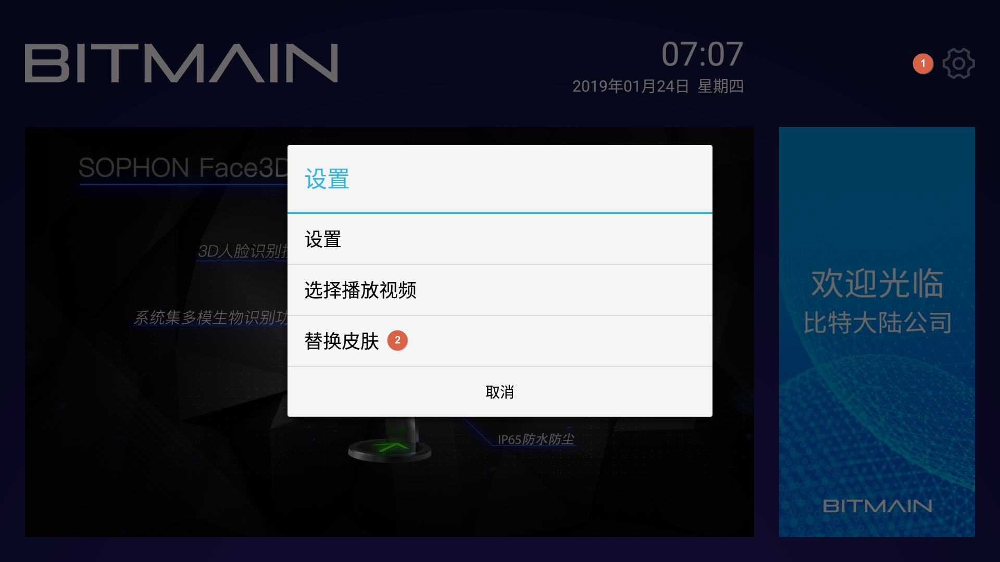
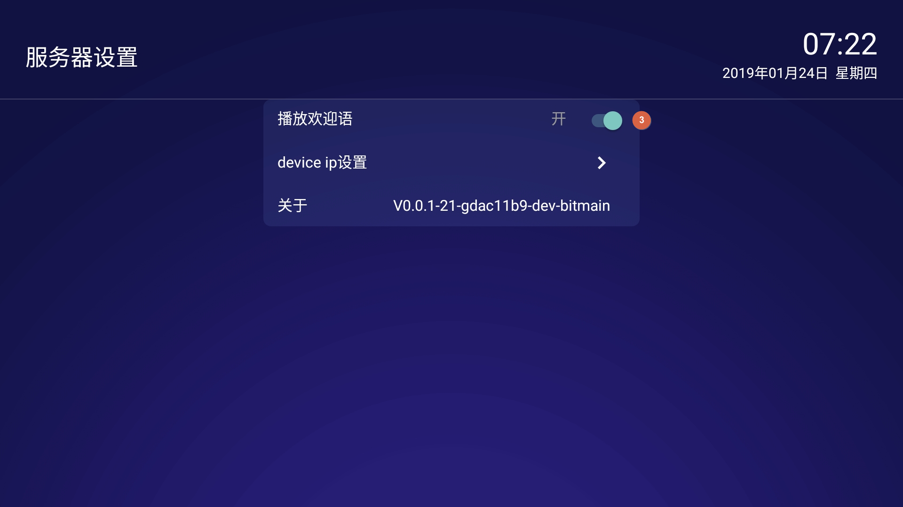
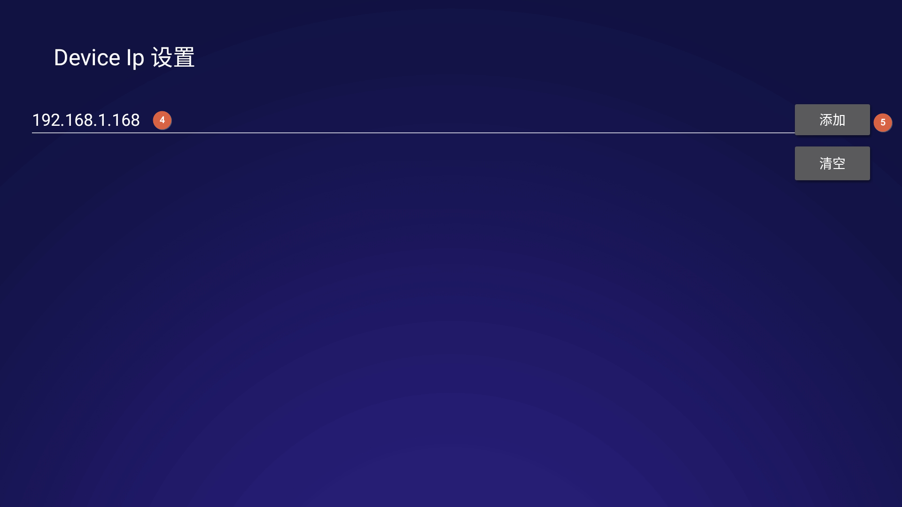

# 迎宾电视APK操作指南


## 4.1 在哪里下载迎宾机APK？

内部下载地址是：

[http://10.32.225.82:8080/apks/autobuild/WelcomeTV/origin/master/](http://10.32.225.82:8080/apks/autobuild/WelcomeTV/origin/master/f0ebca2/WelcomeTV-201901110845-V0.0.1-15-gf0ebca2-demo-release.apk)

## 4.2 如何更改迎宾机界面？



1. 选择右上角 “设置” 按钮
2. 点击 “替换皮肤”
3. 从U盘中浏览到制作好的皮肤文件夾（名字为 "skin"，并且里面有了个子文件夾名字叫 "mipmap"\)
4. 点 “确认”。更换皮肤完成。

   注意:

因为Android电视有兼容性问题，建议在迎宾机APK运行的情况下重新插入U盘。不然可能会发生无法找到U盘的问题发生

在测试过程中发现创维等部分设备内部存储设备不可用，导致替换皮肤失败，考虑到兼容性，创维等设备直接读取U盘里面的皮肤文件，无需重启。

## 4.3 如何定制皮肤？

请以附件zip档案解压缩后存到U盘中，并以它为模板，定制自己的皮肤。请注意，'skin' 这个目录是我们要选择的皮肤目录。

定制皮肤，对logo文件的文件名有无要求？

有，右上角logo文件命名为logo.png,右侧命名为bg\_right.png,文件格式严格要求为png格式。

[skin.zip](https://info.bitmain.vip:8443/download/attachments/59845856/skin.zip?version=2&modificationDate=1552982271000&api=v2)

## 4.3 如何更改播放视频内容？


1. 选择右上角 “设置” 按钮
2. 点击 “选择播放视频”
3. 选择U盘中的视频播放列表文件autoplay.txt文件
4. 点击 “确认”。开始播放文件

## 4.4 如何制作播放列表文件？

请以附件列表文件\(autoplay.txt\)为模板，制作自己的播放文件。

播放视频的能力与电视机支持的视频格式有关，建议使用常用的 MP4 文件格式。

[autoplay.txt](https://info.bitmain.vip:8443/download/attachments/59845856/autoplay.txt?version=1&modificationDate=1548318431000&api=v2)

autoplay.txt内容为根目录下video文件夹下视频地址的列表信息，分行列出。

比如：

```text
    video/trailer.mp4         
    video/mov_bbb.mp4
    video/big_buck_bunny.mp4
```

​ 分别代表的是根目录下video文件夹下面放有名字为trailer，mov\_bbb，big\_buck\_bunny的三个mp4文件。

​ 视频文件名字可以修改，格式为mp4文件，必须在video目录下。

## 4.5 如何关闭欢迎语音？

默认情况下，迎宾机APK会在识别到访客后，播放欢迎语音。

如果不需要此功能，可以按以下步骤关闭。




1. 点击右上角“设置”图标
2. 选择“设置”按钮
3. 点击 “播放欢迎语”，切换为“关闭”状态

## 4.6 如何过滤掉不需要的输入源？

默认情况下，迎宾机APK会显示所有输入源送过来的迎宾信息。在某些环境下，您可能需要过滤掉不需要的图像输入源，比如前门迎宾电视只显示前门抓拍机输入，后门迎宾电视只显示后门抓拍机输出，并且前门和后门抓拍机都连接到同一台SE3小盒子。则可以按如下方法配置使用。




1. 点击右上角 ”设置“ 图标
2. 在弹出的菜单中，选择 设置“
3. 进入子页面后，选择 ”device ip设置“
4. 输入允许接收的抓拍机IP地址
5. 选择 "添加” 按钮。配置完成。

   注意： 可以添加多个允许的抓拍机IP，最多不超过10个。

## 4.7 设置网络接收延迟时间？

默认网络接收延迟时间为300ms,经测试，在无线网络环境下，网络延迟在200ms是比较稳定的，有线网络环境下可以设置为0ms。也可以根据实际情况调试出实际场景的最佳延迟时间。


1. 点击右上角 ”设置“ 图标
2. 在弹出的菜单中，选择 设置“
3. 进入子页面后，选择 ”网络接收延迟“
4. 弹出网络接收延迟设置，修改默认的网络延迟时间。
5. 选择 "确认” 按钮。配置完成。

